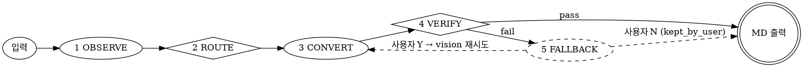

# Document to Markdown Converter

문서(PDF/HWP/HWPX)를 페이지 단위 관측으로 분류하고 변환 후 품질을 검증한다. 침묵 실패를 막는 5단계 구조.

**불변식 (Invariants):**
- 모든 출력 파일은 Step 4 VERIFY를 통과하거나 Step 5 FALLBACK 이력을 남긴다.
- Step 5는 사용자 승인 없이 토큰을 소비하지 않는다.
- Step 3은 OBSERVE 결과 없이 실행되지 않는다.
- OBSERVE는 페이지 단위로 관측치를 수집한다 (Step 2 ROUTE의 페이지별 결정 전제).

## Routing



## Pre-flight Check

**필수** (fail-fast):
```bash
python -c "import pymupdf; print('pymupdf OK')"          # OBSERVE 의존
python -c "import yaml; print('yaml OK')"                 # 임계값 로드
kordoc --version                                          # HWP/HWPX + 한글 PDF
# kordoc 없으면 → npm install -g kordoc
# pdfjs-dist 없으면 → cd "$(npm root -g)/kordoc" && npm install pdfjs-dist
```

**Lazy** (해당 백엔드 호출 시점에만):
- opendataloader: `python -c "import opendataloader_pdf"` + `java -version` — 없으면 영문 PDF는 Vision 폴백
- poppler (Vision Read): `~/tools/poppler/poppler-24.08.0/Library/bin` PATH — 없으면 pymupdf PNG 렌더 폴백
- Vision은 항상 사용 가능 가정

## Step 1 OBSERVE

pymupdf로 페이지 루프 1회 돌며 4개 신호 수집. 산출물은 페이지 단위 `observation` 딕셔너리.

```python
import pymupdf, unicodedata

def _valid(c): return unicodedata.category(c)[0] in ("L", "N", "P", "Z")

def _ar(a):
    return "16:9" if a > 1.6 else "4:3" if a > 1.2 else "A4" if 0.6 < a <= 1.0 else "other"

def observe(pdf_path):
    doc = pymupdf.open(pdf_path)
    pages, ars = [], []
    for i in range(len(doc)):
        page = doc[i]
        text = page.get_text("text")
        blocks = [b for b in page.get_text("dict").get("blocks", []) if b["type"] == 0]
        is_scan = len(blocks) < 3 and len(text.strip()) < 50
        cid = (sum(1 for c in text if _valid(c)) / len(text)) if text else 0.0
        ko = sum(1 for c in text[:500] if "\uac00" <= c <= "\ud7a3")
        en = sum(1 for c in text[:500] if c.isascii() and c.isalpha())
        lang = "ko" if ko > en*2 else "en" if en > ko*2 else "unknown" if ko+en == 0 else "mixed"
        r = page.rect
        ar = r.width / r.height if r.height else 1
        ars.append(ar)
        pages.append({"idx": i+1, "is_scan": is_scan, "cid_health": cid,
                      "language": lang, "layout": "slide" if ar > 1.4 else "body"})
    L = [p["language"] for p in pages]; Y = [p["layout"] for p in pages]
    return {"file_type": "pdf", "pages": pages,
            "doc_meta": {"primary_language": max(set(L), key=L.count),
                         "primary_layout": max(set(Y), key=Y.count),
                         "aspect_ratio": _ar(sum(ars)/len(ars)) if ars else "other"}}
```

| 신호 | 측정 | 의미 |
|---|---|---|
| `is_scan` | 텍스트 블록 < 3 AND 문자 < 50 | True = 스캔 |
| `cid_health` | valid 문자 비율 (L/N/P/Z) | 1=정상, 0=깨짐 |
| `language` | 한글/영문 토큰 비율 (첫 500자) | ko/en/mixed/unknown |
| `layout` | 종횡비 W/H > 1.4 | slide/body |

## Step 2 ROUTE

페이지별 백엔드 결정 → 인접 동일 백엔드 그룹화. `T_cid = 0.80` (spec §7.4.1).

```python
def route(obs, T_cid=0.80):
    plan, cur = [], None
    for p in obs["pages"]:
        if obs["file_type"] in ("hwp", "hwpx"): b = "kordoc"
        elif p["is_scan"]: b = "vision"                  # 스캔
        elif p["cid_health"] < T_cid: b = "vision"       # CID 손상
        elif p["layout"] == "slide": b = "vision"        # kordoc 어절 복원 X
        elif p["language"] == "ko": b = "kordoc"
        elif p["language"] == "en": b = "opendataloader"
        else: b = "vision"                               # 보수적 기본값
        if cur and cur["backend"] == b: cur["pages"].append(p["idx"])
        else: cur = {"pages": [p["idx"]], "backend": b}; plan.append(cur)
    return plan
```

> **주의**: 스캔 PDF를 opendataloader에 넣으면 0바이트 출력. 라우팅이 차단한다.

## Step 3 CONVERT

route_plan의 각 그룹별 백엔드 호출. 혼합 plan은 pymupdf로 sub-PDF 분할 후 변환 → 페이지 순 병합. 출력 주석: `<!-- kordoc p1-5 -->`, `<!-- vision p6-8 -->`. 완료 후 `start "" "OUTPUT.md"`로 결과 오픈.

### kordoc (HWP/HWPX, 한글 PDF — 디지털·body)

```bash
kordoc "INPUT" -o "OUTPUT.md"
```

한국어 어절 복원, "구분/항목/종류" → KV 테이블, 머리글/바닥글 제거, 병합셀 복원, 이미지 추출(``).

### opendataloader (영문 PDF — 디지털·body)

```python
from opendataloader_pdf import convert
convert(input_path="INPUT.pdf", output_dir="OUT_DIR", format="markdown")
```

Java PATH 필요: `export PATH='/c/Program Files/Microsoft/jdk-21.0.10.7-hotspot/bin:$PATH'`.

### vision (스캔, CID 깨짐, 슬라이드, 혼합 기본값)

**10p 청크 필수** (20p 이상 Read 시 품질 급락). Read 도구로 `pages "1-10"` → MD → Write → 반복. poppler 없으면 pymupdf `get_pixmap(dpi=200)` PNG 렌더 후 Read. 50p+ 대형 문서는 서브에이전트 20p씩 분할 → 별도 파일 → **파일 존재 확인 필수** → 합치기. Content Filter(방사선·독성) 차단 시 `[Content filtered - see PDF page N]` 표기 + 5p 재시도 → 안 되면 스킵. 청크 간 `<!-- Page N-M -->` 경계 주석.

## Step 4 VERIFY

변환 결과에 4개 lint signal 측정 → 도메인 heuristic cutoff 비교. **임계값은 아래 표에 박제** — samples에서 역산하지 않는다 (spec §7.4 1B). `samples/thresholds.yaml`은 `baseline_per_layout`만 참조.

**Heuristic** (spec §7.4.1, `_lint_core.HEURISTICS` mirror):

| 시그널 | 방향 | Cutoff | damage mode |
|---|---|---|---|
| V1 `long_token_ratio` | 작을수록 | `> 0.10` | 띄어쓰기 응집 |
| V2 `valid_char_ratio` | 클수록 | `< 0.80` | CID 글리프 치환 |
| V3 `line_length_p99` | 작을수록 | `> 200` | 줄바꿈 손상 |
| V6 `reference_length_ratio` | 클수록 | `< 0.30` | 텍스트 drop |

독립 게이트 — 하나라도 fail하면 VERIFY fail → Step 5. `cid_health`는 OBSERVE 라우팅 전용이라 여기서 빠진다 (`_lint_core.HEURISTICS` 5키, VERIFY 4키 — asymmetry by design).

```python
import re, unicodedata, yaml
from pathlib import Path

HEURISTICS = {
    "long_token_ratio":       (">", 0.10),
    "valid_char_ratio":       ("<", 0.80),
    "line_length_p99":        (">", 200),
    "reference_length_ratio": ("<", 0.30),
}

def _valid(c): return unicodedata.category(c)[0] in ("L", "N", "P", "Z")

def verify(md_path, obs, thresholds_path):
    body = Path(md_path).read_text(encoding="utf-8")
    if body.startswith("---\n"):
        end = body.find("\n---\n", 4)
        if end > 0: body = body[end + 5:]
    T = yaml.safe_load(open(thresholds_path, encoding="utf-8"))
    baseline = T.get("baseline_per_layout", {}).get(obs["doc_meta"]["primary_layout"], 300)
    pages = len(obs["pages"])

    toks = body.split()
    long_pat = re.compile(r"\S{10,}")
    v1 = sum(1 for t in toks if long_pat.fullmatch(t)) / max(len(toks), 1)
    v2 = sum(1 for c in body if _valid(c)) / max(len(body), 1)
    in_fence, lens = False, []
    for ln in body.splitlines():
        if ln.lstrip().startswith("```"): in_fence = not in_fence; continue
        if not in_fence and ln.strip(): lens.append(len(ln))
    lens.sort()
    v3 = lens[min(int(len(lens)*0.99), len(lens)-1)] if lens else 0
    v6 = len(body) / max(pages * baseline, 1)

    sig = {"long_token_ratio": v1, "valid_char_ratio": v2,
           "line_length_p99": v3, "reference_length_ratio": v6}
    failed = [n for n, (op, t) in HEURISTICS.items()
              if (sig[n] > t if op == ">" else sig[n] < t)]
    return {"pass": not failed, "damages": sig,
            "failed_signals": failed, "thresholds_used": HEURISTICS}
```

> **혼합 레이아웃 한계**: V6의 baseline은 `primary_layout` 단일값. 본문+슬라이드 섞인 PDF는 V6가 왜곡 가능 → V1·V2·V3가 보조 방어.

## Step 5 FALLBACK (조건부)

`verify_result.pass == False`일 때만 실행. **사용자 승인 없이 토큰 소비 금지** (불변식 2).

사용자에게 다음 형식으로 리포트:

```
[VERIFY fail] {filename}
백엔드: {current_backend}  |  페이지: {N}p
실패 시그널:
  - long_token_ratio: 0.13 (> 0.10) → 띄어쓰기 손상 의심
  - valid_char_ratio: 0.45 (< 0.80) → CID 매핑 손상 의심
샘플: "{첫 손상 토큰 3개 미리보기}"

Vision 폴백할까요? (Y/N)
```

| 응답 | 동작 |
|---|---|
| **Y** | Step 3 재진입, 모든 페이지 `backend=vision` 강제 → Step 4 재검증. **재진입은 1회만**. 재검증 실패 시 frontmatter에 `vision_fallback_also_failed: true`, `failed_signals: [...]`, `kept_after_fallback: YYYY-MM-DD` 기록. |
| **N** | 현재 파일 유지. frontmatter에 `lint_fail: true`, `failed_signals: [...]`, `kept_by_user: YYYY-MM-DD` 기록. |

## Output

출력 파일에 포함:
- 마크다운 본문
- 페이지 경계 + 처리 경로 주석: `<!-- kordoc p1-5 -->`, `<!-- vision p6-8 -->`
- frontmatter:

```markdown
---
source: "파일명.pdf"
pages: N
method: kordoc | opendataloader | vision | mixed
converted: YYYY-MM-DD
# VERIFY 실패 시 추가 필드:
lint_fail: true                     # 실패 + 사용자 유지
failed_signals: [long_token_ratio, ...]
kept_by_user: YYYY-MM-DD            # 사용자가 N 응답
vision_fallback_also_failed: true   # 폴백도 실패
kept_after_fallback: YYYY-MM-DD     # 폴백 후 유지
---
```

변환 완료 후 `start "" "OUTPUT.md"`로 결과 오픈.
