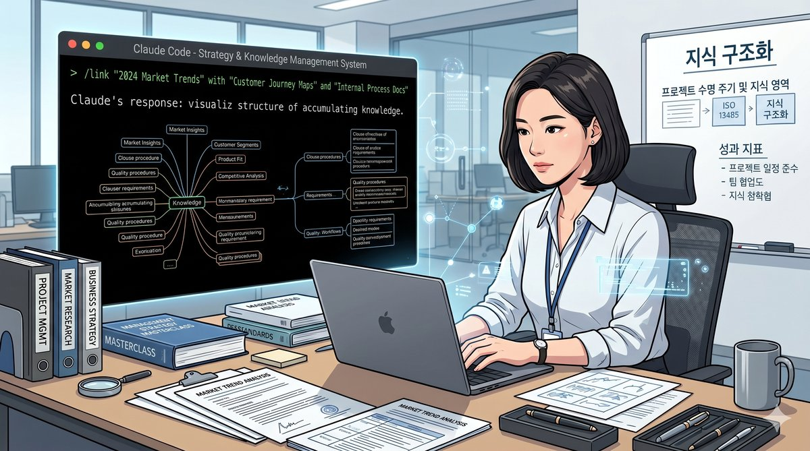
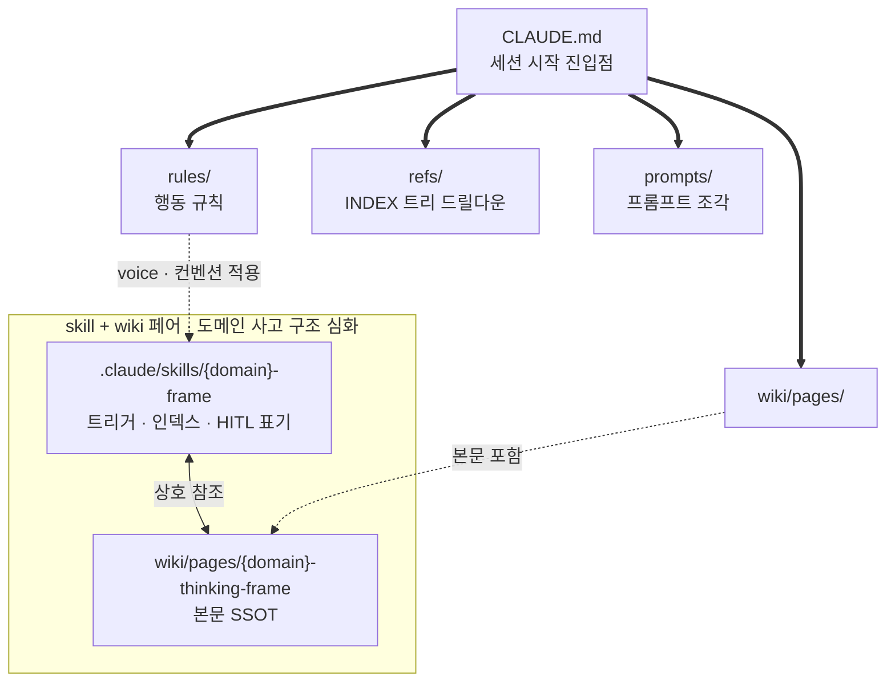
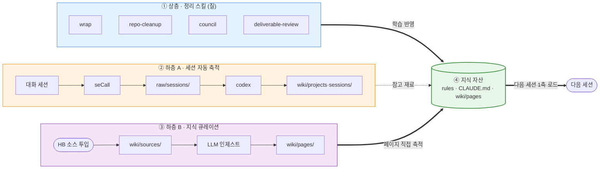
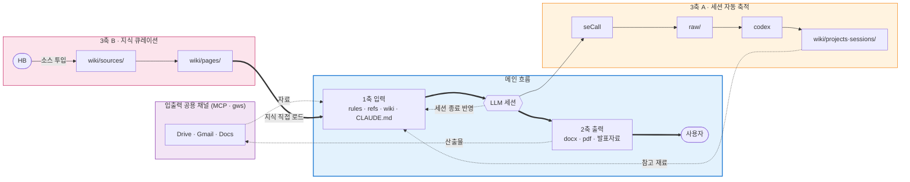

<h1 align="center">비개발자 하네스</h1>



> [!NOTE]
> **무엇** — 비개발자(도메인 전문가)가 Claude Code를 운영체제처럼 쓰기 위한 3축 하네스
> **왜** — 개발자 하네스의 축(계획·위임·TDD)과 비개발자 축(구조·맥락·축적)은 다릅니다. 이 차이를 명시화하지 않으면 비개발자는 약한 결과만 얻습니다
> **시작** — fork/clone 후 `CLAUDE.md`를 자기 도메인에 맞게 편집, `wiki/sources/`와 `refs/`에 자기 자료 채우기

도메인 전문가가 Claude Code를 자기 워크플로우의 운영체제처럼 운용하기 위해 구성한 하네스입니다. 개발자 중심으로 형성된 기존 하네스 정의를 비개발자 관점에서 다시 세운 작동 사례입니다.

## 목차

- [핵심 발견 — 구조와 맥락이 즉석 요청을 대신 처리합니다](#핵심-발견--구조와-맥락이-즉석-요청을-대신-처리합니다)
- [왜 3축인가](#왜-3축인가)
- [전체 Workflow](#전체-workflow)
- [가중치 비대칭 — 맥락이 진짜 원천입니다](#가중치-비대칭--맥락이-진짜-원천입니다)
- [자가 진단 — `check-harness-context-first` 스킬](#자가-진단--check-harness-context-first-스킬)
- [핵심 패턴 3가지](#핵심-패턴-3가지)
- [가설은 어디서 나왔나](#가설은-어디서-나왔나)
- [이 레포는 작동 사례입니다](#이-레포는-작동-사례입니다)
- [사용법](#사용법)
- [참고·영감·의존성](#참고영감의존성)
- [라이선스](#라이선스)

이 레포는 사용법 매뉴얼이기 이전에 하나의 가설입니다. 비개발자(도메인 전문가)가 LLM으로 생산성을 크게 늘리려 할 때 필요한 하네스의 축은 개발자가 쓰는 축과 본질적으로 다르며, 이 차이를 명시화하지 않으면 비개발자는 자기에게 맞지 않는 틀 위에서 약한 결과만 얻는다는 가설입니다. 결과물은 이 가설을 작동 사례로 고정한 형태입니다.

## 핵심 발견 — 구조와 맥락이 즉석 요청을 대신 처리합니다

> [!TIP]
> 구조(폴더 체계와 컨벤션)와 맥락(지식 변환 방식과 wiki 참조 구조)이 미리 고정되어 있으면, 사용자가 "해줘~" 같은 짧은 즉석 요청을 던져도 LLM이 스스로 좋은 결과를 냅니다.

이 지점이 개발자 하네스와 가장 크게 갈립니다. 개발자 하네스에서 결과 품질을 결정하는 요소는 계획 비율, 위임 비율, 반복 패턴 자동화, TDD 같은 실행 규율이지만, 비개발자의 작업은 구조와 맥락을 기반으로 기존 산출물을 확대 재생산하거나 유사한 양식을 사용하는 패턴이 많습니다. 구조와 맥락을 한 번 고정해두는 **1회 투자가 이후 수십~수백 번의 요청을 처리**해주므로, 투자 회수 구조가 반대로 형성됩니다.

비개발자가 끌어내는 결과의 힘은 매 세션 시작 시점부터 작동 전제를 결정하는 **구조와 맥락**에서 나옵니다. 매 작업마다 계획을 새로 짜는 규율은 부차적입니다.

## 왜 3축인가

작업 사이클은 세 단계로 흐릅니다. 3축은 이 단계에 그대로 대응합니다.

1. **입력** — 도메인 지식을 AI가 인식할 수 있는 형태로 전달합니다
2. **출력** — AI가 처리한 결과를 사람이 받을 수 있는 형식으로 바꿉니다
3. **맥락 유지** — 사이클이 한 세션에서 끝나지 않고 다음 세션으로 이어지며 계속 쌓여갑니다

이 세 단계가 그대로 3축이 됩니다. 

| 축 | 정의 | 핵심 자산 |
|---|------|----------|
| **1축 입력** | 기존 지식을 AI 인식 가능한 형태로 전환 | rules · refs · wiki · prompts · CLAUDE.md · skill과 wiki 페어 |
| **2축 출력** | AI 산출물을 사람이 받는 형식으로 변환 | docx · pdf · 발표자료 |
| **3축 맥락 유지** | 세션 간 맥락 보존과 누적 | wrap · repo-cleanup · council · deliverable-review · `wiki/raw/sessions/` (seCall 자동 수집) · `wiki/wiki/projects·sessions/` (codex 1차 정리) |
| **입출력 공용 채널** (1축과 2축에 걸침) | 입력과 출력 양쪽에서 쓰는 도구 | MCP 서버 · Google Workspace CLI |

입출력 공용 채널은 Drive, Gmail, Docs처럼 자료를 가져올 때(입력)와 산출물을 올릴 때(출력) 양쪽에서 쓰는 도구입니다. 어느 한 축에만 묶이지 않으므로 별도로 표기했습니다.

### 1축 입력 — 자동 로드되는 지식 자산의 구조

1축은 "세션 시작 시 자동 로드"가 핵심입니다. `CLAUDE.md`가 진입점이 되어 `rules/` · `refs/` · `wiki/pages/` · `prompts/`를 끌어오고, 그 위에 `skill + wiki 페어`가 도메인 사고 구조를 심화하는 도구로 작동합니다. skill을 wiki와 함께 쓰는 이유는 단일 skill만으로 구현하면 스킬만 양산되고 재사용되지 않는 한계가 있기 때문입니다(자세한 사유는 아래 패턴 2 참조).



### 2축 출력 — 산출물 변환 체인

2축은 LLM이 생성한 Markdown을 사람이 받을 수 있는 형식(docx · pdf · 발표자료)으로 변환하는 체인입니다. 각 변환 스킬은 "단일 소스(MD) → 변환 도구 → 최종 포맷" 순서를 따릅니다. 단일 소스 원칙(`rules/qms-sop.md`) 덕분에 수정은 항상 MD에서 이루어지고 docx·pdf는 재생성되므로, 양방향 drift가 원천 차단됩니다.


### 3축 맥락 유지 — 삼층 축적 구조

3축은 세 층으로 작동합니다. **상층**은 맥락을 정리·반영하는 스킬 4종(`wrap` · `repo-cleanup` · `council` · `deliverable-review`)입니다. **하층**은 두 경로로 나뉩니다. 하나는 세션 자동 축적 — 대화 세션이 seCall로 자동 수집·요약되어 참고 재료가 되는 파이프라인입니다. 다른 하나는 지식 큐레이션 — HB가 직접 `wiki/sources/`에 소스를 투입하면 LLM이 도메인 지식을 `wiki/pages/`로 정제하는 경로입니다. 세션 자동 축적이 원재료의 양을 쌓는다면, 지식 큐레이션은 도메인 판단과 해석이 농축된 질을 쌓습니다.



## 전체 Workflow

세 자산은 함께 돕니다. 3축이 개별 자산 묶음이라면, 실제 세션은 이 자산들이 하나의 workflow로 묶여 돌아갑니다. 3축 맥락 유지는 두 경로로 쌓입니다 — 세션이 끝날 때마다 seCall이 자동으로 아카이빙하는 경로(3축 A)와, HB가 직접 소스를 투입해 LLM이 도메인 지식 페이지를 만드는 지식 큐레이션 경로(3축 B)입니다. 두 경로 모두 1축 입력으로 자동 로드되면서 세션을 거듭할수록 강해집니다.



이 workflow의 핵심은 **3축 맥락 유지의 이중 축적**입니다. 대화가 휘발되지 않고 다음 세 경로로 맥락 자산이 되어 쌓입니다.

1. **seCall** — 대화 로그를 `wiki/raw/sessions/YYYY-MM-DD/`로 자동 수집
2. **codex 파이프라인** — raw 세션을 `wiki/wiki/projects·sessions/`로 요약·분류, 프로젝트·주제 단위 드릴다운 가능
3. **wrap 스킬** — 세션 종료 시 학습 내용을 `rules` · `CLAUDE.md` · `wiki pages`로 반영

이렇게 쌓인 자산이 다음 세션의 1축 입력으로 자동 로드되면서, 같은 질문도 세션을 거듭할수록 더 좋은 결과로 돌아옵니다.

## 가중치 비대칭 — 맥락이 진짜 원천입니다

개발자 하네스의 6축 평가는 균등 가중을 씁니다. 비개발자 하네스를 같은 방식으로 측정하면 가중치가 비대칭으로 드러납니다.


> [!IMPORTANT]
> 개발자 하네스는 6축 균등(각 16.7%)입니다. 비개발자 재정의에서는 맥락(입력)이 50%로 올라가고, 계획·실행·검증 3축이 합산 10%로 통합됩니다. 구조와 맥락 유지(개선)는 15%로 유사하게 유지됩니다.

이 가중치는 6축 균등 평균과 다른 약점·강점을 짚어내므로, 비개발자에게 **더 정확한 진단**을 내려줍니다.

## 자가 진단 — `check-harness-context-first` 스킬

가중치 비대칭이 단순한 시각화에 그치지 않고 실제 진단 도구로 작동해야 의미가 있습니다. 기존 `check-harness` 스킬은 개발자 워크플로우(test runner · formatter hook · lint · CI)를 전제로 6축 24항목을 균등 가중으로 측정합니다. 이 기준을 비개발자 하네스에 그대로 들이대면 검증 항목 절반이 빈 칸으로 나오고, 정작 비개발자가 의존하는 자산(refs INDEX 드릴다운 · wiki 5-layer · skill과 wiki 페어 · handoff 라이프사이클)은 측정 대상에서 빠집니다.

`check-harness-context-first`는 이 갭을 메우려고 만든 파생 스킬입니다. 원본 v3에서 개발 지향 항목 3건(B1 검증 스킬 호출 · D1 검증 자산 · D2 lint 훅)을 비개발자 등가물(verification skill · deliverable-review · 문서 lint 훅)로 재정의하고, 비개발자 하네스 고유 영역 6건을 신규 항목으로 추가해 **6축 30항목 체크리스트**로 확장했습니다. 4개 서브에이전트(`skill-portfolio-analyzer` · `session-pattern-analyzer` · `context-quality-reviewer` · 신규 `context-first-auditor`)를 병렬 실행해 데이터를 수집하고, 결과는 `.harness/check-reports/check-harness-context-first-{날짜}-{scope}/` 아래 HTML/MD 리포트로 저장됩니다.

추가된 6항목은 비개발자 하네스 고유 영역에 직접 대응합니다.

| ID | 점검 항목 | 의미 |
|---|---|---|
| C7 | refs/INDEX 드릴다운 무결성 | 정적 지식이 INDEX 트리로 빠르게 탐색되는지 |
| C8 | wiki 5-layer 구분 유지 | sources / pages / raw / wiki / schema 경계 준수 |
| C9 | skill + wiki 페어 정합성 | 도메인 사고 구조가 페어 구조로 묶여 있는지 |
| B7 | 출력 스킬 호출 흐름 | docx · pdf · pdf-to-md 등 2축 출력 자산이 실제 호출되는지 |
| E4 | handoff 라이프사이클 폐쇄 | 생성·재개·완료가 git history로 끝나는지 |
| E5 | seCall→codex 파이프라인 최근성 | 세션 자동 축적이 끊기지 않고 흐르는지 |

> [!TIP]
> 비개발자 하네스를 fork·clone해 자기 도메인 자료를 채운 뒤 한 달쯤 운용하고 `/check-harness-context-first` 스킬로 자가 진단해 보면 어느 축이 비어 있는지 한눈에 보입니다. 본 레포 자체에 대한 진단 리포트도 `.harness/check-reports/`에 동봉되어 있어 어떤 형식으로 결과가 나오는지 미리 확인할 수 있습니다.

## 핵심 패턴 3가지

가설은 고정된 패턴으로 검증됩니다. 이 레포의 작동 사례 3건이 앞의 3축에 그대로 대응합니다.

### 1. 폴더 구조와 컨벤션 — 1차 고정 (구조와 입력)

`rules/`·`refs/`·`wiki/`·`prompts/`·`CLAUDE.md`로 구성된 폴더 구조가 비개발자 암묵지를 명시지로 변환하는 1차 고정입니다. 사용자의 짧은 요청 "이거 정리해줘"가 세션 시작 시점부터 글쓰기 voice·관련 규정·사고 구조·컨벤션을 동시에 불러와 처리됩니다.

### 2. skill과 wiki 페어 — 맥락의 심화 (입력 심화)

도메인 사고 구조(인허가 전략, 법무 검토, 임상 설계)는 단일 skill에 고정하면 응용이 어렵습니다. skill에는 트리거·인덱스·HITL 표기만 두고 본문은 wiki page에 단일 출처로 보관하는 페어 구조가 효과적입니다. 첫 사례는 `medical-device-ra-qa-frame` 스킬과 `medical-device-ra-qa-thinking-frame.md` 페이지의 페어입니다.

### 3. 살아있는 맥락 — 세션마다 자라는 자산

외부 도구가 보관소 검색을 맡는다면, 이 하네스는 스킬 4종(`wrap` · `repo-cleanup` · `council` · `deliverable-review`)과 삼층 축적 구조(세션 자동 축적 + 지식 큐레이션)로 맥락의 보존과 축적을 맡깁니다. 이 공유 레포에는 세션 원재료가 포함되지 않으며, 운영 환경에서 seCall을 설치하면 자기 세션이 자동 수집됩니다.

## 가설은 어디서 나왔나

의료기기 RA/QA + RWE 임상 QA 영역에서 Claude Code를 모노레포로 운용하며 얻은 세 가지 발견이 가설의 기반입니다.

- **5라운드 교정 패턴** — 한 SaMD 프로젝트의 spec을 다섯 번 교정하는 과정에서 매번 동일한 사고 구조가 반복된다는 사실을 확인했습니다. 이것이 "암묵지를 LLM에 전수하는" 작업이며, 매번 처음부터 설명하지 않도록 고정할 가치가 있다는 통찰이었습니다
- **check-harness 측정 비대칭** — 본인 하네스를 6축 균등 평가로 측정했을 때 점수는 51점이 나왔으나 자세히 보면 맥락 68점(강함), 구조 30점(약함), 계획 0점(부재)으로 비대칭이 뚜렷했습니다. 그런데 실제 작업 결과는 좋았습니다. 즉 계획과 실행 축이 약해도 맥락이 강하면 결과가 좋다는 정량 증거였습니다
- **즉석 요청의 자동 처리** — 구조와 맥락이 미리 고정되어 있으면 사용자가 짧게 던진 요청도 LLM이 스스로 좋은 결과를 낸다는 점이 개발자 하네스의 계획 우선 규율과 가장 크게 갈리는 지점이었습니다

이 가설은 실제 운영 모노레포 경험에서 나왔으며 single repo에서도 동일하게 적용 가능합니다. 관건은 monorepo·single repo 형식이 아니라 **폴더 구조와 컨벤션의 명시화 여부**입니다.

## 이 레포는 작동 사례입니다

이 레포는 위 가설을 고정한 작동 사례입니다. fork 또는 clone 후 자기 도메인 자료를 채워 바로 사용 가능합니다.

```
.
├── CLAUDE.md             ← 운영 매뉴얼 (LLM 자동 로드, 사용법·구조·컨벤션 일체)
├── README.md             ← 본 파일 (가설·경험·3축 시각화·workflow)
├── .claude/skills/       ← 12종 (3축 분포 + medical-device-ra-qa-frame 페어 사례)
├── .claude/agents/       ← 12종 (검증·메타 reviewer)
├── .claude/hooks/        ← 운영 4종 (session-start-handoff-scan · session-start-context-inject · wiki-check · block-template-write) + 테스트 1종
├── rules/                ← 행동 규칙 7개 (content-writing·naming·binary-files·qms-sop·workflow·handoff·session-entry)
├── refs/                 ← 정적 지식 (FDA 3계층 153건: statute 117 · regulation 35 · guidance 1 sample)
├── wiki/                 ← 동적 지식 (5개 층: sources·pages·raw/sessions·wiki/projects·sessions·schema, medical-device 사고 구조 1건)
├── prompts/              ← LLM 운영 프롬프트 fragment
└── tools/                ← 운영 자동화 도구 (generate-weights-png.py 등)
```

## 사용법

> [!NOTE]
> 운영 매뉴얼은 [`CLAUDE.md`](./CLAUDE.md)에 있습니다. Claude Code가 세션 시작 시 자동 로드하므로 사용자가 직접 읽지 않아도 LLM이 컨벤션에 따라 작동합니다.

1. 이 레포를 fork 또는 `git clone`
2. `CLAUDE.md`의 "사용자 시작 가이드" 따라 환경 설치 (Claude Code, Python, bash, 선택 MCP)
3. `.mcp.json`의 `<PATH_TO>` placeholder를 자기 환경 경로로 수정 (hwp 등 선택 MCP를 쓸 경우)
4. (선택) 세션 자동 아카이빙을 원하면 [seCall](https://github.com/hang-in/seCall) 설치 — 대화 세션이 `wiki/raw/sessions/YYYY-MM-DD/`로 자동 수집되어 다음 세션 참고 재료가 됩니다
5. `wiki/sources/`와 `refs/`에 자기 도메인 자료 채우기. 세션 시작 시 `wiki-check` hook이 `wiki/pages/`에서 미참조된 소스를 알려주므로 LLM에게 ingest를 요청하면 됩니다. PDF가 있으면 `pdf-to-md` 스킬로 MD 변환 후 ingest
6. 첫 작업 시 LLM이 `medical-device-ra-qa-frame` 패턴 보고 자기 도메인 thinking frame 페어 고정을 제안
7. 세션 종료 시 `wrap` 스킬로 맥락 반영, 다음 세션은 SessionStart hook이 handoff·lessons를 자동 주입

## 참고·영감·의존성

이 레포는 여러 선행 프로젝트와 타인의 노하우 위에 올라가 있습니다. 직접 포함한 외부 코드, 구조적 영감, 그리고 스킬 출처 일반을 분리해 밝힙니다.

### 직접 포함·의존

- **seCall** — [hang-in/seCall](https://github.com/hang-in/seCall). 대화 세션을 `wiki/raw/sessions/YYYY-MM-DD/`로 자동 수집하는 3축 하층 파이프라인의 수집기로 사용합니다
- **Google Workspace CLI (gws)** — [googleworkspace/cli](https://github.com/googleworkspace/cli). 입출력 공용 채널(Drive, Docs, Gmail)의 실제 호출 계층입니다

### 구조적 영감

- **wiki 3층 구조(sources → pages → schema)** — Andrej Karpathy의 [LLM Wiki 패턴](https://gist.github.com/karpathy/442a6bf555914893e9891c11519de94f)에서 영감을 받아 도메인 클러스터 기반으로 재구성했습니다
- **skill/agent 기반 하네스 구성** — 카카오 [revfactory/harness](https://github.com/revfactory/harness)에서 하네스 개념을 받아 비개발자 작업 사이클(3축)에 맞게 재배치했습니다
- **rules 체계 + 캠프 맥락** — 이 레포 자체가 **AI Native Camp Harness**의 일부입니다. 원래 `CLAUDE.md` 한 파일 안에 섞여 있던 규칙들을, 캠프에서 이호연 님([team-attention/hoyeon](https://github.com/team-attention/hoyeon))의 운영 노하우를 따라 `rules/*.md`로 분리해 섹션별 자동 로드 구조로 정리했습니다

### 스킬 출처

`.claude/skills/` 아래 스킬은 대부분 외부 출처가 있는 자산을 이 운영 환경(HB voice, 위키 구조, handoff 체계)에 맞게 개조해 쓰는 것들입니다.

- **council · wrap** — [team-attention/plugins-for-claude-natives](https://github.com/team-attention/plugins-for-claude-natives)
- **check-harness** — [team-attention/harness](https://github.com/team-attention/harness) (harness-session 플러그인 v0.3.1)
- **skill-creator** — [anthropics/skills](https://github.com/anthropics/skills) (Anthropic 공식)
- **pdf-to-md** — [microsoft/markitdown](https://github.com/microsoft/markitdown) + [chrisryugj/kordoc](https://github.com/chrisryugj/kordoc) 라우팅 기반
- **그 외(docx · pdf · repo-cleanup · deliverable-review · gws-setup · medical-device-ra-qa-frame · tool-setup)** — 이 레포 자체 작성

## 라이선스

MIT
