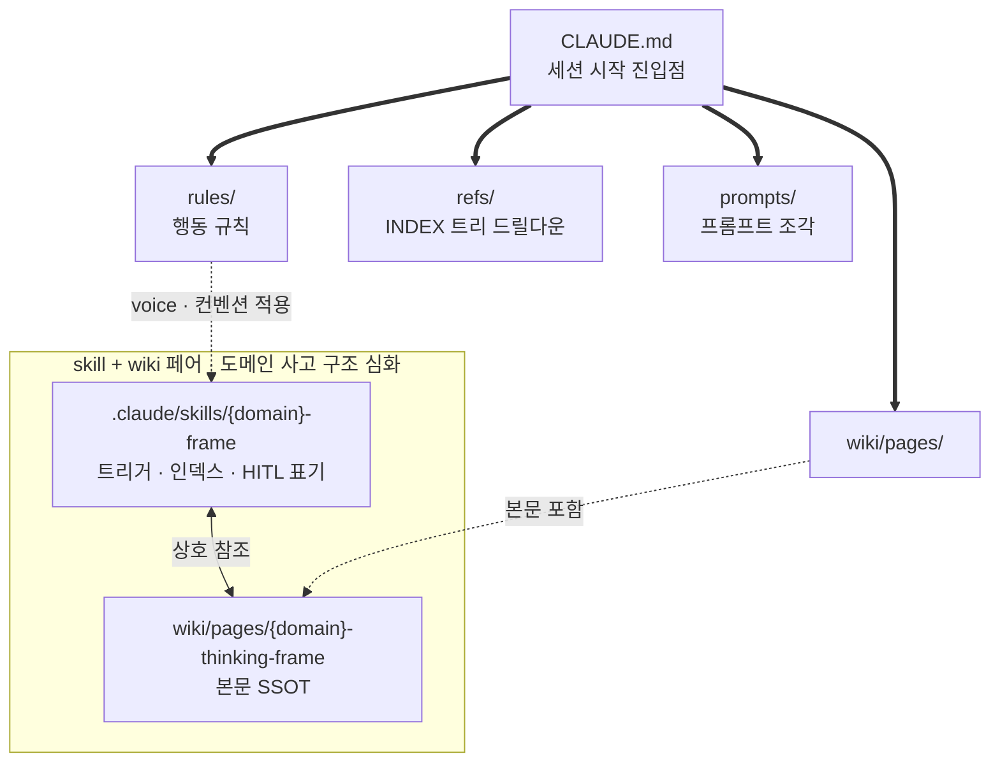
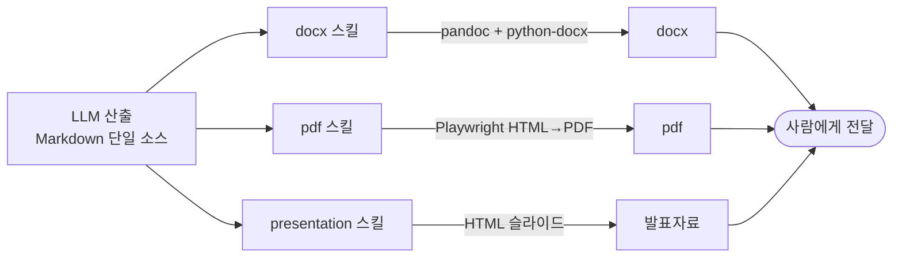
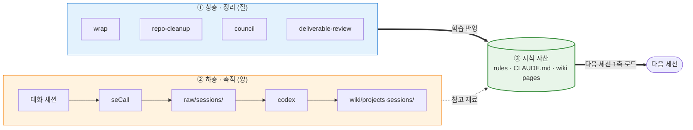
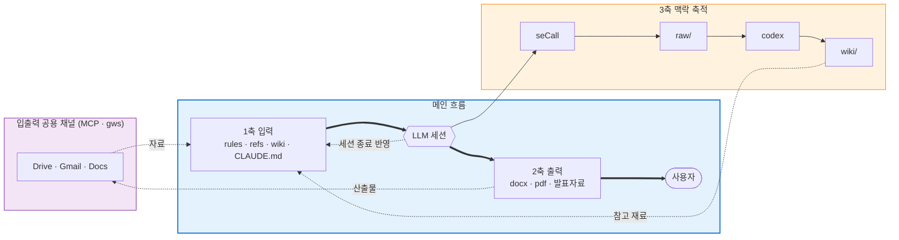
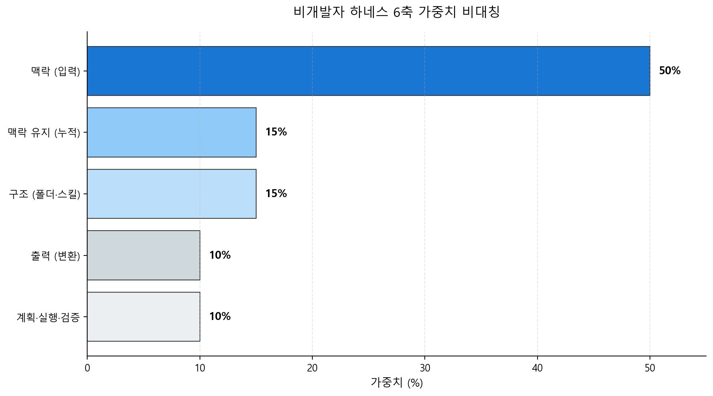

# 비개발자 하네스

> [!NOTE]
> **무엇** — 비개발자(도메인 전문가)가 Claude Code를 운영체제처럼 쓰기 위한 3축 하네스
> **왜** — 개발자 하네스의 축(계획·위임·TDD)과 비개발자 축(구조·맥락·축적)은 다릅니다. 이 차이를 명시화하지 않으면 비개발자는 약한 결과만 얻습니다
> **시작** — fork/clone 후 `CLAUDE.md`를 자기 도메인에 맞게 편집, `wiki/sources/`와 `refs/`에 자기 자료 채우기

도메인 전문가가 Claude Code를 자기 워크플로우의 운영체제처럼 운용하기 위해 구성한 하네스입니다. 개발자 중심으로 형성된 기존 하네스 정의를 비개발자 관점에서 다시 세운 작동 사례입니다.

## 목차

- [핵심 발견 — 구조와 맥락이 즉석 요청을 대신 처리합니다](#핵심-발견--구조와-맥락이-즉석-요청을-대신-처리합니다)
- [왜 3축인가](#왜-3축인가)
- [전체 Workflow](#전체-workflow)
- [가중치 비대칭 — 맥락이 진짜 원천입니다](#가중치-비대칭--맥락이-진짜-원천입니다)
- [핵심 패턴 3가지](#핵심-패턴-3가지)
- [가설은 어디서 나왔나](#가설은-어디서-나왔나)
- [이 레포는 작동 사례입니다](#이-레포는-작동-사례입니다)
- [사용법](#사용법)
- [참고·영감·의존성](#참고영감의존성)
- [라이선스](#라이선스)

이 레포는 사용법 매뉴얼이기 이전에 하나의 가설입니다. 비개발자(도메인 전문가)가 LLM으로 생산성을 크게 늘리려 할 때 필요한 하네스의 축은 개발자가 쓰는 축과 본질적으로 다르며, 이 차이를 명시화하지 않으면 비개발자는 자기에게 맞지 않는 틀 위에서 약한 결과만 얻는다는 가설입니다. 결과물은 이 가설을 작동 사례로 고정한 형태입니다.

## 핵심 발견 — 구조와 맥락이 즉석 요청을 대신 처리합니다

> [!TIP]
> 구조(폴더 체계와 컨벤션)와 맥락(지식 변환 방식과 wiki 참조 구조)이 미리 고정되어 있으면, 사용자가 "해줘~" 같은 짧은 즉석 요청을 던져도 LLM이 스스로 좋은 결과를 냅니다.

이 지점이 개발자 하네스와 가장 크게 갈립니다. 개발자 하네스에서 결과 품질을 결정하는 요소는 계획 비율, 위임 비율, 반복 패턴 자동화, TDD 같은 실행 규율이지만, 비개발자의 작업은 구조와 맥락을 기반으로 기존 산출물을 확대 재생산하거나 유사한 양식을 사용하는 패턴이 많습니다. 구조와 맥락을 한 번 고정해두는 1회 투자가 이후 수십~수백 번의 요청을 처리해주므로, 투자 회수 구조가 반대로 형성됩니다.

비개발자가 끌어내는 결과의 힘은 매 세션 시작 시점부터 작동 전제를 결정하는 구조와 맥락에서 나옵니다. 매 작업마다 계획을 새로 짜는 규율은 부차적입니다.

## 왜 3축인가

3축은 비개발자 작업 사이클의 세 단계에 그대로 대응합니다.

1. **입력** — 도메인 지식을 AI가 인식할 수 있는 형태로 전달합니다
2. **출력** — AI가 처리한 결과를 사람이 받을 수 있는 형식으로 바꿉니다
3. **맥락 유지** — 사이클이 한 세션에서 끝나지 않고 다음 세션으로 이어지며 계속 쌓여갑니다

이 세 단계가 그대로 3축이 됩니다. 

| 축 | 정의 | 핵심 자산 |
|---|------|----------|
| **1축 입력** | 기존 지식을 AI 인식 가능한 형태로 전환 | rules · refs · wiki · prompts · CLAUDE.md · skill과 wiki 페어 |
| **2축 출력** | AI 산출물을 사람이 받는 형식으로 변환 | docx · pdf · 발표자료 |
| **3축 맥락 유지** | 세션 간 맥락 보존과 누적 | wrap · repo-cleanup · council · deliverable-review · `wiki/raw/sessions/` (seCall 자동 수집) · `wiki/wiki/projects·sessions/` (codex 1차 정리) |
| **입출력 공용 채널** (1축과 2축에 걸침) | 입력과 출력 양쪽에서 쓰는 도구 | MCP 서버 · Google Workspace CLI |

입출력 공용 채널은 Drive, Gmail, Docs처럼 자료를 가져올 때(입력)와 산출물을 올릴 때(출력) 양쪽에서 쓰는 도구입니다. 어느 한 축에만 묶이지 않으므로 별도로 표기했습니다.

### 1축 입력 — 자동 로드되는 지식 자산의 구조

1축은 "세션 시작 시 자동 로드"가 핵심입니다. `CLAUDE.md`가 진입점이 되어 `rules/` · `refs/` · `wiki/pages/` · `prompts/`를 끌어오고, 그 위에 `skill + wiki 페어`가 도메인 사고 구조를 심화하는 도구로 작동합니다. skill을 wiki와 함께 쓰는 이유는 단일 skill만으로 구현하면 스킬만 양산되고 재사용되지 않는 한계가 있기 때문입니다(자세한 사유는 아래 패턴 2 참조).



### 2축 출력 — 산출물 변환 체인

2축은 LLM이 생성한 Markdown을 사람이 받을 수 있는 형식(docx · pdf · 발표자료)으로 변환하는 체인입니다. 각 변환 스킬은 "단일 소스(MD) → 변환 도구 → 최종 포맷" 순서를 따릅니다. 단일 소스 원칙(`rules/qms-sop.md`) 덕분에 수정은 항상 MD에서 이루어지고 docx·pdf는 재생성되므로, 양방향 drift가 원천 차단됩니다.



### 3축 맥락 유지 — 이중 축적 구조

3축은 두 층으로 작동합니다. **상층**은 맥락을 정리·반영하는 스킬 4종(`wrap` · `repo-cleanup` · `council` · `deliverable-review`)이고, **하층**은 대화 세션이 자동 수집·요약되어 다음 세션의 참고 재료가 되는 파이프라인(`seCall` → `wiki/raw/sessions/` → `codex` → `wiki/wiki/projects·sessions/`)입니다. 상층이 질을 높이는 정리 층이라면 하층은 원재료가 쌓이는 누적 층입니다. 두 층이 모두 rules · CLAUDE.md · wiki pages로 모여 다음 세션의 1축 입력으로 자동 로드되면서 순환이 닫힙니다.



## 전체 Workflow

3축이 개별 자산 묶음이라면, 실제 세션은 이 자산들이 하나의 workflow로 돌아갑니다. 특히 3축 맥락 유지는 대화가 끝날 때마다 자동으로 아카이빙되는 파이프라인을 타고 세션을 거듭할수록 강해지는 누적 구조입니다.



이 workflow의 핵심은 **3축 맥락 유지의 이중 축적**입니다. 대화가 휘발되지 않고 다음 세 경로로 맥락 자산이 되어 쌓입니다.

1. **seCall** — 대화 로그를 `wiki/raw/sessions/YYYY-MM-DD/`로 자동 수집
2. **codex 파이프라인** — raw 세션을 `wiki/wiki/projects·sessions/`로 요약·분류, 프로젝트·주제 단위 드릴다운 가능
3. **wrap 스킬** — 세션 종료 시 학습 내용을 `rules` · `CLAUDE.md` · `wiki pages`로 반영

이렇게 쌓인 자산이 다음 세션의 1축 입력으로 자동 로드되면서, 같은 질문도 세션을 거듭할수록 더 좋은 결과로 돌아옵니다.

## 가중치 비대칭 — 맥락이 진짜 원천입니다

개발자 하네스의 6축 평가는 균등 가중을 씁니다. 비개발자 하네스를 같은 방식으로 측정하면 가중치가 비대칭으로 드러납니다.



> [!IMPORTANT]
> 맥락(입력) 50%가 전체 점수의 절반입니다. 구조 15% · 맥락 유지 15% · 출력 10% · 계획·실행·검증 합계 10%가 나머지 절반을 나눠 갖습니다. 즉석 요청이 본질인 작업이라 계획·실행·검증 축은 약하게 작동합니다.

이 가중치는 6축 균등 평균과 다른 약점·강점을 짚어내므로, 비개발자에게 더 정확한 진단을 내려줍니다.

## 핵심 패턴 3가지

가설은 고정된 패턴으로 검증됩니다. 이 레포의 작동 사례 3건이 앞의 3축에 그대로 대응합니다.

### 1. 폴더 구조와 컨벤션 — 1차 고정 (구조와 입력)

이 레포의 폴더 구조와 컨벤션 자체가 비개발자 암묵지를 명시지로 변환하는 1차 고정입니다. 사용자가 매번 "이렇게 해줘"를 반복할 필요 없이 매 세션 시작 시점부터 알아서 작동합니다.

- `rules/` — 매 세션 자동으로 불러오는 행동 규칙 (글쓰기 voice, 파일명 컨벤션, SOP 작성 패턴, workflow, handoff 등)
- `refs/` — 정적 지식(규정, 정책, 표준)을 INDEX 트리로 정리합니다. AI가 검색할 때 INDEX부터 드릴다운합니다
- `wiki/` — 동적 지식(도메인 사고 구조, 의사결정 근거, 새 개념)을 도메인 클러스터로 누적합니다
- `prompts/` — 케이스별 LLM 운영 프롬프트 조각
- `CLAUDE.md` — 모든 컨벤션의 진입점. Claude Code가 세션 시작 시 자동으로 불러옵니다

이 고정이 깔려 있으면 사용자의 짧은 요청 "이거 정리해줘"가 LLM 안에서 rules의 글쓰기 voice, refs의 관련 규정, wiki의 사고 구조, CLAUDE.md의 산출물 컨벤션을 동시에 불러와 처리됩니다.

### 2. skill과 wiki 페어 — 맥락의 심화 (입력 심화)

비개발자의 도메인 사고 구조(인허가 전략, 법무 검토, 임상 설계 같은 판단 흐름)는 단일 skill에만 고정하면 같은 흐름을 다른 사안에 적용하기 어렵습니다. skill에는 트리거와 인덱스, 사람 손이 필요한 영역 표기만 두고 본문은 wiki page에 단일 출처로 보관하는 페어 구조가 효과적입니다.

첫 사례는 `.claude/skills/medical-device-ra-qa-frame` 스킬과 `wiki/pages/medical-device-ra-qa-thinking-frame.md` 페이지의 페어입니다. 1부 명시지 원칙(자동 적용 4축)과 2부 사람 손이 필요한 영역(3영역)으로 구성됩니다. 다른 도메인(임상 컨설팅, 법무, 교육 등)으로 확장할 때도 같은 페어 구조로 자기 사고 구조를 고정합니다.

이 패턴은 1번 폴더 구조 위에 얹힌 한 단계 깊은 층입니다. skill과 wiki의 분리가 곧 "본문의 지속적 발전 가능성"과 "트리거의 안정성"을 동시에 가능하게 해줍니다.

### 3. 살아있는 맥락 — 세션마다 자라는 자산 (맥락 유지)

비개발자에게 맥락은 매 세션에서 자라는 동적 자산입니다. 외부 도구가 보관소 검색을 맡는다면, 이 하네스는 다음 4종으로 세션 간 맥락의 보존과 축적을 맡깁니다.

- **wrap** — 세션 종료 시 학습한 내용을 wiki page · CLAUDE.md · rules로 되돌려 반영합니다
- **repo-cleanup** — 누적된 임시 파일과 중복 자료를 주기적으로 정리해, 저품질 입력이 저품질 출력으로 이어지는 것을 막고 맥락 로딩이 지저분해지지 않도록 합니다
- **council** — 여러 AI 페르소나가 교차로 검토해 단일 모델의 자기확증 편향을 완화합니다
- **deliverable-review** — 산출물 검증 게이트를 두어 도메인별 reviewer에게 자동으로 보냅니다

4종 스킬 위에 **세션 원재료 축적 파이프라인**이 깔립니다. 매 대화 세션이 seCall 도구로 `wiki/raw/sessions/YYYY-MM-DD/`에 자동 수집되고, codex 파이프라인이 이를 `wiki/wiki/projects·sessions/`로 요약·분류합니다. LLM은 새 wiki page를 만들거나 기존 page를 갱신할 때 이 정리된 세션 층을 참고 재료로 씁니다. 스킬 4종은 상층에서 맥락을 정리·반영하고, 세션 파이프라인은 하층에서 원재료를 쌓습니다. 이 공유 레포에는 세션 원재료가 포함되지 않습니다(사용자 개인 대화 로그). 운영 환경에서 seCall을 설치하면 자기 세션이 자동 수집됩니다.

이 4종 스킬 + 세션 파이프라인이 함께 작동해야 맥락이 자라며, 자란 맥락이 다음 세션의 결과 품질을 한 단계 더 높이는 전제가 됩니다.

## 가설은 어디서 나왔나

의료기기 RA/QA + RWE 임상 QA 영역에서 Claude Code를 모노레포로 운용하며 얻은 세 가지 발견이 가설의 기반입니다.

- **5라운드 교정 패턴** — 한 SaMD 프로젝트의 spec을 다섯 번 교정하는 과정에서 매번 동일한 사고 구조가 반복된다는 사실을 확인했습니다. 이것이 "암묵지를 LLM에 전수하는" 작업이며, 매번 처음부터 설명하지 않도록 고정할 가치가 있다는 통찰이었습니다
- **check-harness 측정 비대칭** — 본인 하네스를 6축 균등 평가로 측정했을 때 점수는 51점이 나왔으나 자세히 보면 맥락 68점(강함), 구조 30점(약함), 계획 0점(부재)으로 비대칭이 뚜렷했습니다. 그런데 실제 작업 결과는 좋았습니다. 즉 계획과 실행 축이 약해도 맥락이 강하면 결과가 좋다는 정량 증거였습니다
- **즉석 요청의 자동 처리** — 구조와 맥락이 미리 고정되어 있으면 사용자가 짧게 던진 요청도 LLM이 스스로 좋은 결과를 낸다는 점이 개발자 하네스의 계획 우선 규율과 가장 크게 갈리는 지점이었습니다

이 가설은 KHC 모노레포 운영 경험에서 나왔으며 single repo에서도 동일하게 적용 가능합니다. 관건은 monorepo·single repo 형식이 아니라 **폴더 구조와 컨벤션의 명시화 여부**입니다.

## 이 레포는 작동 사례입니다

이 레포는 위 가설을 고정한 작동 사례입니다. fork 또는 clone 후 자기 도메인 자료를 채워 바로 사용 가능합니다.

```
.
├── CLAUDE.md             ← 운영 매뉴얼 (LLM 자동 로드, 사용법·구조·컨벤션 일체)
├── README.md             ← 본 파일 (가설·경험·3축 시각화·workflow)
├── .claude/skills/       ← 12종 (3축 분포 + medical-device-ra-qa-frame 페어 사례)
├── .claude/agents/       ← 12종 (검증·메타 reviewer)
├── .claude/hooks/        ← 운영 4종 (handoff-scan · context-inject · wiki-check · block-template-write) + 테스트 1종
├── rules/                ← 행동 규칙 7개 (content-writing·naming·binary-files·qms-sop·workflow·handoff·session-entry)
├── refs/                 ← 정적 지식 (FDA 3계층 153건: statute 117 · regulation 35 · guidance 1 sample)
├── wiki/                 ← 동적 지식 (5개 층: sources·pages·raw/sessions·wiki/projects·sessions·schema, medical-device 사고 구조 1건)
└── prompts/              ← LLM 운영 프롬프트 fragment
```

## 사용법

사용법, 폴더 구조, 컨벤션, skill과 wiki 페어 작성법, MCP 설정 등 운영 매뉴얼은 모두 [`CLAUDE.md`](./CLAUDE.md)에 정리되어 있습니다. Claude Code가 세션 시작 시 자동으로 불러오므로 사용자가 직접 읽지 않아도 LLM이 컨벤션에 따라 작동합니다.

## 참고·영감·의존성

이 레포는 여러 선행 프로젝트와 타인의 노하우 위에 올라가 있습니다. 직접 포함한 외부 코드, 구조적 영감, 그리고 스킬 출처 일반을 분리해 밝힙니다.

### 직접 포함·의존

- **seCall** — [hang-in/seCall](https://github.com/hang-in/seCall). 대화 세션을 `wiki/raw/sessions/YYYY-MM-DD/`로 자동 수집하는 3축 하층 파이프라인의 수집기로 사용합니다
- **Google Workspace CLI (gws)** — [googleworkspace/cli](https://github.com/googleworkspace/cli). 입출력 공용 채널(Drive, Docs, Gmail)의 실제 호출 계층입니다

### 구조적 영감

- **wiki 3층 구조(sources → pages → schema)** — Andrej Karpathy의 [LLM Wiki 패턴](https://gist.github.com/karpathy/442a6bf555914893e9891c11519de94f)에서 영감을 받아 도메인 클러스터 기반으로 재구성했습니다
- **skill/agent 기반 하네스 구성** — 카카오 [revfactory/harness](https://github.com/revfactory/harness)에서 하네스 개념을 받아 비개발자 작업 사이클(3축)에 맞게 재배치했습니다
- **rules 체계 + 캠프 맥락** — 이 레포 자체가 **AI Native Camp Harness**의 일부입니다. 원래 `CLAUDE.md` 한 파일 안에 섞여 있던 규칙들을, 캠프에서 이호연 님([team-attention/hoyeon](https://github.com/team-attention/hoyeon))의 운영 노하우를 따라 `rules/*.md`로 분리해 섹션별 자동 로드 구조로 정리했습니다

### 스킬 출처

`.claude/skills/` 아래 스킬은 대부분 외부 출처가 있는 자산을 이 운영 환경(HB voice, 위키 구조, handoff 체계)에 맞게 개조해 쓰는 것들입니다.

- **council · wrap** — [team-attention/plugins-for-claude-natives](https://github.com/team-attention/plugins-for-claude-natives)
- **check-harness** — [team-attention/harness](https://github.com/team-attention/harness) (harness-session 플러그인 v0.3.1)
- **skill-creator** — [anthropics/skills](https://github.com/anthropics/skills) (Anthropic 공식)
- **pdf-to-md** — [microsoft/markitdown](https://github.com/microsoft/markitdown) + [chrisryugj/kordoc](https://github.com/chrisryugj/kordoc) 라우팅 기반
- **그 외(docx · pdf · repo-cleanup · deliverable-review · gws-setup · medical-device-ra-qa-frame · tool-setup)** — 이 레포 자체 작성

## 라이선스

MIT
